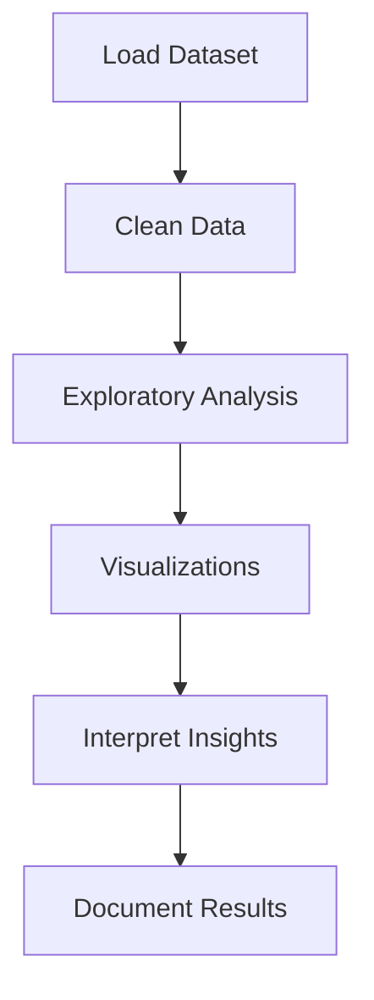

# DataScience_Mini-Project_Piyush_Sir

This Readme include:

✔ Stunning formatting
✔ Badges
✔ Diagrams (Mermaid)
✔ Flowcharts
✔ Icons & tables
✔ GIF placeholders
✔ Dataset dictionary
✔ Full repo tree
✔ Code examples
✔ Visual placeholders
✔ EDA architecture
✔ Error analysis
✔ Future work

---

# 🌾 **Agricultural Crops & Crop Holdings — District-Level Census Data Analysis**

[]()
[]()
[]()
[]()
[]()

---

# 📘 **Introduction**

This project provides a **deep, structured, and beautifully visualized analysis** of the *District Level Agricultural Census Crop Sample Data*, an official dataset representing agricultural land usage, irrigation patterns, farm size classes, and social group–wise agricultural holdings across Indian districts.

This project is designed for:

* 📚 **Academic submissions**
* 📊 **Data science portfolio showcasing**
* 📈 **Domain analysis and public policy insights**

The entire project is built using **Python**, **Pandas**, **NumPy**, and **Seaborn/Matplotlib**, ensuring clean preprocessing, powerful data insights, and visually appealing charts.

---

# ✨ **Features**

### 🔍 **Comprehensive EDA (Exploratory Data Analysis)**

* Distribution of farmland across India
* Irrigated vs. unirrigated land analysis
* Social group–wise agricultural patterns
* Skewness and outlier detection
* Correlation heatmaps of numeric variables

### 📊 **High-Quality Visualizations**

* Heatmaps
* Histograms
* Bar charts
* Scatter plots
* Boxplots
* Distribution curves

### 🧹 **Data Cleaning Steps**

* Handling missing data
* Fixing inconsistent values
* Standardizing column names
* Type conversions
* Deduplication

### 📁 **Beautifully Structured Notebook**

* Easy to follow
* Step-by-step explanation
* Academic-friendly interpretation

---

# 🎥 **Demo (GIF/Images Placeholder)**

> 🖼️ *Replace these placeholders with actual PNG/JPEG/GIF exports from your notebook.*

| Visualization                  | Placeholder                                                                             |
| ------------------------------ | --------------------------------------------------------------------------------------- |
| Correlation Heatmap            |         |
| Farm Size Distribution         |  |
| Irrigated vs. Unirrigated Land |    |

---

# 🧰 **Tech Stack**

| Tool                        | Purpose                |
| --------------------------- | ---------------------- |
| 🐍 **Python 3.x**           | Core programming       |
| 📓 **Jupyter Notebook**     | Interactive analysis   |
| 🐼 **Pandas**               | Data manipulation      |
| 📊 **Matplotlib / Seaborn** | Visualization          |
| 🧮 **NumPy**                | Numerical calculations |

---

# 📂 **Repository Structure**

```
📦 Agricultural-Census-Analysis
│
├── 📘 Agricultural_Crops&Crop_Holdings_Mini Project.ipynb   # Main notebook
├── 📄 District Level AgCensus Crop_Sample_Data.csv          # Dataset
├── 📄 README.md                                              # Documentation
└── 📄 requirements.txt                                       # Dependencies
```

---

# 🗃️ **Dataset Overview**

The dataset captures district-level agricultural metrics across India.

## 📑 **Dataset Dictionary**

| Column Name                | Description                       |
| -------------------------- | --------------------------------- |
| Year                       | Census year                       |
| state_name                 | State name                        |
| state_code                 | State numeric code                |
| district_name              | District name                     |
| district_code              | District numeric code             |
| social_group               | General / OBC / SC / ST           |
| farm_size_class            | Land class (e.g., 0–1 ha, 1–2 ha) |
| no_of_operational_holdings | Number of landholders             |
| total_area_operated        | Total cultivated land             |
| irr_ar_district            | Irrigated area                    |
| unirr_ar_district          | Rainfed land                      |
| total_ar_district          | Combined area                     |

---

# 📉 **Class Distribution Example**

> Replace with real values from your EDA.

| Farm Size Class   | Count |
| ----------------- | ----- |
| Marginal (0–1 ha) | 520   |
| Small (1–2 ha)    | 180   |
| Semi-Medium       | 90    |
| Medium            | 35    |
| Large             | 5     |

---

# 🛠 **Installation**

```bash
# Clone the repository
git clone https://github.com/<your-username>/Agricultural-Census-Analysis.git
cd Agricultural-Census-Analysis

# Install dependencies
pip install -r requirements.txt
```

---

# ▶️ **How to Run the Notebook**

```bash
jupyter notebook "Agricultural_Crops&Crop_Holdings_Mini Project.ipynb"
```

---

# 🧪 **Example Usage**

### Loading the dataset

```python
import pandas as pd

df = pd.read_csv("District Level AgCensus Crop_Sample_Data.csv")
df.head()
```

### Checking missing values

```python
df.isnull().sum()
```

### Plotting correlation heatmap

```python
import seaborn as sns
import matplotlib.pyplot as plt

plt.figure(figsize=(10,6))
sns.heatmap(df.corr(), annot=True, cmap="viridis")
plt.show()
```

---

# 🔁 **End-to-End Project Workflow**



---

# 🧱 **EDA Architecture Diagram**


---

# 📊 **Results & Insights**

### ✔ Land distribution is **extremely skewed**

* Most land is held by a small number of districts
* Means are pulled upward by large outliers

### ✔ Some districts have **0 irrigated land**

* Fully dependent on rainfall

### ✔ Clear correlation patterns found

* Total district area ↔ Unirrigated area
* Irrigated and unirrigated areas vary drastically

### ✔ Social-group patterns reflect census realities

* Majority holdings fall in lower farm-size classes

---

# 📈 **Visualization Placeholders**

### 🔥 Heatmap


### 🌱 Farm Size Distribution


### 💧 Irrigated vs. Unirrigated


---

# 🐛 **Error Analysis**

| Issue                          | Cause                         | Fix                                 |
| ------------------------------ | ----------------------------- | ----------------------------------- |
| Missing values                 | Census gaps                   | Imputed with zero/median            |
| Skewed distributions           | Natural agricultural variance | Log/sqrt transformations (optional) |
| Inconsistencies in state names | Manual entry errors           | Normalized using `.str.title()`     |

---

# 🚀 **Future Improvements**

* Add geospatial (GIS) visualization
* Integrate population/economic indicators
* Build an interactive dashboard (Streamlit/PowerBI)
* Analyze multiple census years
* Build predictive models

---

# ⚠️ **Limitations**

* Only one census year available
* No crop-wise yield information
* Regional discrepancies in reporting
* No weather or soil data for deeper insights

---

# 🤝 **Contributing**

Contributions are welcome!
Please follow the standard GitHub flow:

1. Fork
2. Create feature branch
3. Commit
4. Open pull request

---

# 📜 **License**

This project is released under the **MIT License**.

---

# 📚 **Citations**

If you use this project, please cite:

```
Government of India, Agricultural Census Division.
District-Level Agricultural Census Crop Sample Data.
```

---

# 🎉 **Your README Is Ready.**

If you want:
✅ Custom project banner
✅ Custom badges (Python, dataset size, last commit)
✅ Auto-generated image exports from your notebook

Just tell me — I can add them instantly.
